# Developer Guide

---

## Table of Contents

1. [Overall Architecture](#overall-architecture)
2. [CCA Commands](#cca-commands)
   - [Add CCA Command](#add-cca-command)
   - [View CCA Command](#view-cca-command)
   - [Delete CCA Command](#delete-cca-command)
   - [Add EXCO to CCA Command](#add-exco-to-cca-command)
   - [View all EXCOs of a CCA](#view-all-the-excos-of-a-cca)
   - [CCA Statistics Command](#cca-statistics-command)
3. [Resident Commands](#resident-commands)
   - [Add Resident Command](#add-resident-command)
   - [View Resident Command](#view-resident-command)
   - [Delete Resident Command](#delete-resident-command)
   - [Add Resident to CCA Command](#add-resident-to-cca-command)
   - [View Points Command](#view-points-command)
   - [Resident Statistics Command](#resident-statistics-command)
4. [Event Commands](#event-commands)
   - [Add Event Command](#add-event-command)
   - [Add Resident to Event Command](#add-resident-to-event-command)
   - [View My Events Command](#view-my-events-command)
   - [View CCA Events Command](#view-cca-events-command)
5. [General Commands](#general-commands)
   - [Help Command](#help-command)

---


## Quick Start

Follow the steps below to set up and run the application:

### Prerequisites
- Ensure that you have **Java 17** installed on your system.
- You can verify your Java version by running:
  ```
  java -version
  ```
- If the version is not Java 17, install it before proceeding.

---

### Download the Application
1. Go to the project repository:  
   https://github.com/AY2526S2-CS2113-W13-1/tp
2. Navigate to the **Releases** section.
3. Download the latest `.jar` file.

---

### Running the Application
1. Open a terminal/command prompt.
2. Navigate to the folder containing the `.jar` file.
3. Run the following command:
   ```
   java -jar CCAledger.jar
   ```

---

### First Run
- The application will start in the terminal.
- You can begin entering commands immediately.
- Use the following command to see available commands:
  ```
  help
  ```

---

### Notes
- Ensure that the `.jar` file is in the correct directory before running.
- If the application does not start, re-check your Java version and installation.
- All data will be stored locally in the same directory as the `.jar` file.


## Overall Architecture

CcaLedger follows a layered, command-driven architecture built around the **Command Pattern**.
In the Command Pattern, each user action (e.g. `add-cca`, `delete-resident`) is encapsulated as a self-contained `Command` object with a single `execute()` method. The `Parser` is responsible for creating the correct `Command` subclass from raw user input.`CcaLedger` then simply calls `execute()` on whatever command it receives — without needing to know which specific operation is being performed. This keeps the orchestration layer thin and makes adding new commands straightforward: create a new subclass, register it in the Parser, and nothing else changes.
Each layer has a single responsibility and communicates only with its immediate neighbours.

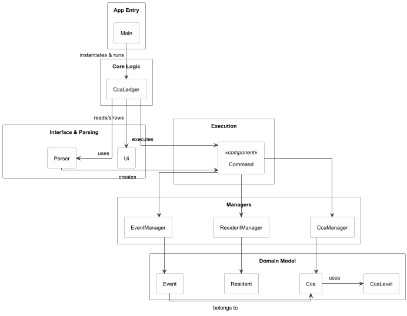

The diagram above shows the six layers and their relationships. The table below summarises each layer's role.

| Layer         | Key Classes                                     | Responsibility                                                |
|---------------|-------------------------------------------------|---------------------------------------------------------------|
| Entry Point   | `Main`                                          | Instantiates `CcaLedger` and calls `run()`.                   |
| Orchestration | `CcaLedger`                                     | Owns the main loop; coordinates all components.               |
| UI & Parsing  | `Ui`, `Parser`                                  | Handles console I/O; translates input into `Command` objects. |
| Command       | `Command` and subclasses                        | Encapsulates a single user-facing operation.                  |
| Managers      | `CcaManager`, `ResidentManager`, `EventManager` | Holds and mutates application state.                          |
| Domain Model  | `Cca`, `Resident`, `Event`, `CcaLevel`          | Plain data objects with no business logic.                    |


### Command Pattern
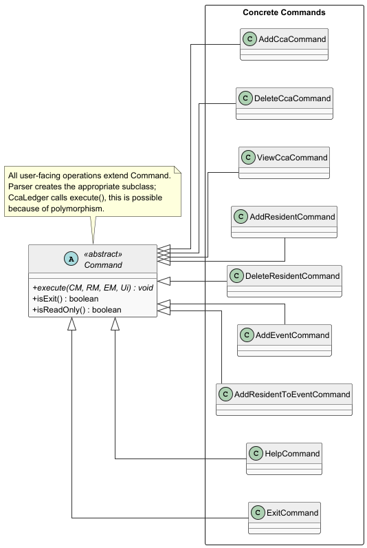

Class diagram showing the **Command Pattern**. `Parser` instantiates the correct
`Command` subclass; `CcaLedger` calls `execute()` without knowing  the concrete type. All subsequent command sections implement this pattern and will reference this diagram.

**How a command executes (happy path) (refer to Command Pattern class diagram above):**
1. `Ui.readInput()` reads a line from the user.
2. `Parser.parse(input)` inspects the string and returns the appropriate `Command` subclass.
3. `CcaLedger` calls `command.execute(ccaManager, residentManager, eventManager, ui)`.
4. The command calls the relevant manager method(s) and prints feedback via `Ui`.
5. If `command.isExit()` returns `true`, the loop terminates.


### Reference: Common Command Execution Flow

All commands in this document share the same top-level execution flow — user input is read,
parsed into a `Command` object, and `execute()` is called by `CcaLedger`. This is captured
once in the diagram below and referenced by all subsequent sequence diagrams to avoid repetition.

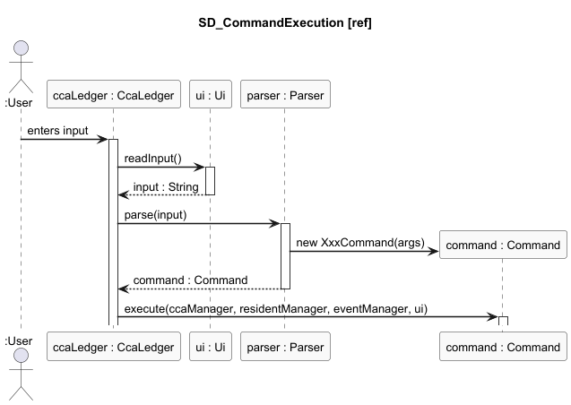


**Key design rules:**
- Domain objects (`Cca`, `Resident`, `Event`) have no outward dependencies.
- Managers never reference `Ui`, `Parser`, or `Command`.
- Commands receive all dependencies as method parameters in `execute()` — they store nothing.
- `Command` subclasses are only ever instantiated inside `Parser.parse()`.

---

### Domain Model

The Domain Model layer contains plain data objects with no outward dependencies.
All state is owned and mutated by the Manager layer above.

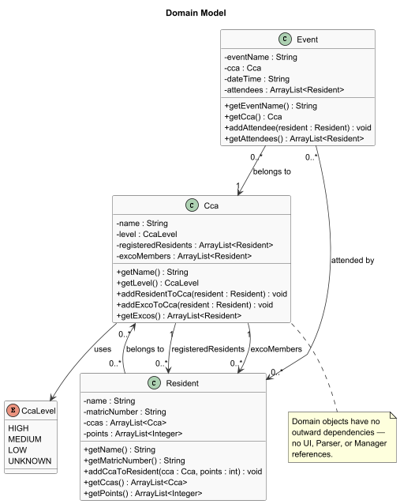

*Class diagram of the Domain Model layer. These are plain data objects with no
dependencies on any other layer. All business logic and state changes is
sent upward to the Manager layer.*

### Managers

The Managers layer holds and mutates application state. Each manager owns one
type of domain object and exposes methods for creating, retrieving, and deleting them.

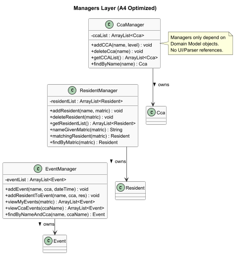


*Class diagram of the Managers layer. Each manager owns and mutates its respective
domain objects. Managers have no knowledge of the UI, Parser, or Command layers.*

### UI and Parsing
The UI and Parsing layer handles all console I/O and translates raw user input into
Command objects. `Ui` is the only class that writes to the console.

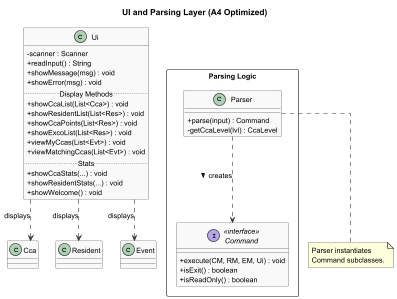
*Class diagram of the UI and Parsing layer. `Parser` is the sole factory for
`Command` objects. `Ui` handles all console output and has no outward dependencies
beyond the domain model objects it displays.*

---
## CCA Commands

### Add CCA Command

#### Overview

The `add-cca` command adds a new CCA to the system.

Format:
`add-cca <cca name>; <level>`

---

#### Implementation

The `add-cca` command is implemented using the Command pattern.

- The `Parser` creates an `AddCcaCommand` object from user input.
- `AddCcaCommand.execute()` calls `CcaManager.addCCA(...)`.
- If the CCA already exists, a `DuplicateCcaException` is thrown and handled.


#### Sequence Diagram


#### Design Considerations


This command follows the Command Pattern described in the [Architecture section](#overall-architecture).
Duplicate CCA detection is handled inside `CcaManager`, keeping business logic centralised and
the command layer thin.

#### Alternatives Considered
1. Direct Invocation from Parser to Manager
   Approach: Parser directly calls `CcaManager.addCCA(...)`
   Rejected because:
- Violates separation of concerns
- Makes Parser overly complex
- Reduces extensibility

---

### View CCA Command

#### Overview

The `view-cca` command displays the list of all CCAs stored in the system.

Format:
`view-cca`

---

#### Implementation

The `view-cca` command retrieves and displays all CCAs.

- The `Parser` creates a `ViewCcaCommand` object.
- `ViewCcaCommand.execute()` calls `CcaManager.getCCAList()`.
- The retrieved list is passed to `Ui.showCcaList(...)` for display.


#### Sequence Diagram


---

### Delete CCA Command

#### Overview

The `delete-cca` command removes an existing CCA from the system.

Format:
`delete-cca <cca name>`

---

#### Implementation

The `delete-cca` command is implemented using the Command pattern.

- The `Parser` creates a `DeleteCcaCommand` object from user input.
- `DeleteCcaCommand.execute()` calls `CcaManager.deleteCca(...)`.
- If the CCA does not exist, a `CcaNotFoundException` is thrown and handled.


#### Sequence Diagram
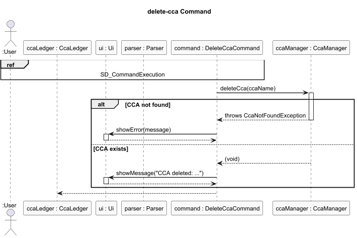


#### Design Considerations

This command follows the Command Pattern described in the [Architecture section](#overall-architecture).
The non-existence check is handled by `CcaManager`, which throws `CcaNotFoundException` —
the command only handles display of the resulting error.
#### Alternatives Considered
1. Direct Invocation from Parser to Manager  
   Approach: Parser directly calls `CcaManager.deleteCca(...)`  
   Rejected because:
   - Violates separation of concerns
   - Makes Parser overly complex
   - Reduces extensibility

---

### Add EXCO to CCA Command

#### Overview

The `add-exco-to-cca` command adds an existing resident as an EXCO for the Cca.

Format:
`add-exco-to-cca <matric number>; <cca name>`

---

#### Implementation

- The `Parser` creates a `AddExcoToCcaCommand` object.
- The command retrieves the `Resident` from `ResidentManager`.
- The corresponding `Cca` is retrieved from `CcaManager`.
- The `Resident` is added to the Cca as an EXCO in the `excoResidents` arraylist.
- Exceptions are thrown if the resident or CCA does not exist.


#### Sequence Diagram

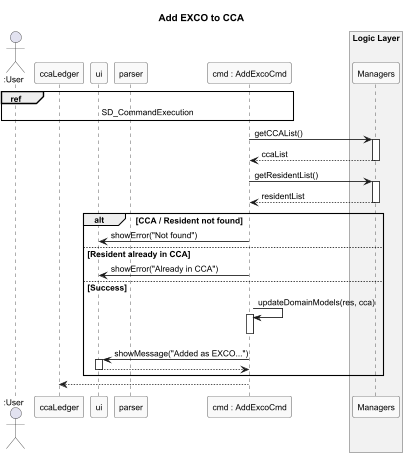

---

### View all the EXCOs of a CCA

#### Overview
The `view-exco` command display the list of EXCOs of an existing Cca.

Format:
`view-exco <cca name>`

#### Implementation

- The `Parser` creates a `ViewCcaExco` object.
- The command retrieves the `CcaList` from `CcaManager`.
- It checks if the `Cca` input is a part of `CcaList`
- If no it throws a `CcaNotFoundException`.
- If yes, then is displays the `excoMembers` of a `Cca`


#### Sequence Diagram

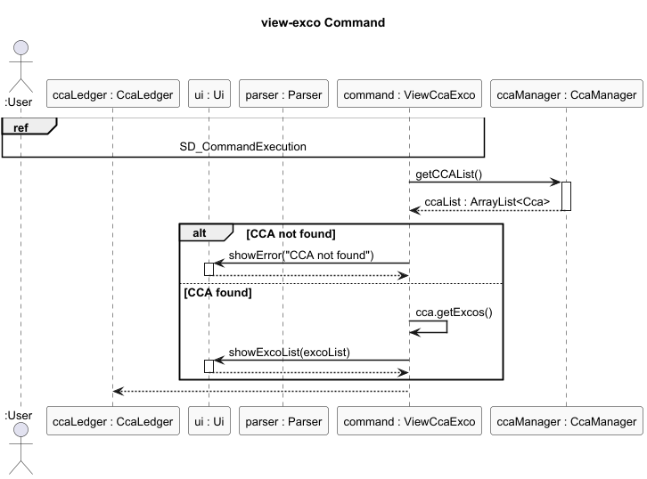

---

### CCA Statistics Command

#### Overview

The `cca-stats` command displays the average points and most active member for each CCA as well as the most popular CCA based on the average points.

Format:
`cca-stats`

---

#### Implementation

- The `Parser` creates a `CcaStatsCommand` object.
- `CcaStatsCommand.avgPoints()` computes the average points for each CCA.
- `CcaStatsCommand.mostPopularCca()` finds the most popular CCA by finding the CCA with the highest average points.
- `CcaStatsCommand.mostActiveResidents()` finds the most active member of each CCA by taking the resident with the most points for that CCA.
- If there are no CCAs in the first place, `CcaStatsCommand.execute()` passes a message to the user through `Ui.showMessage()`. Otherwise, it passes the above information to `Ui.showCcaStats()` for display.


#### Sequence Diagram
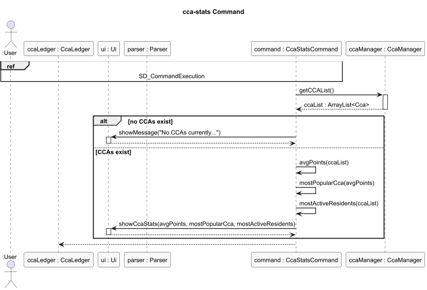

---

## Resident Commands

### Add Resident Command

#### Overview

The `add-resident` command adds a new resident to the system.

Format:  
`add-resident <resident name>; <matric number>`

---

#### Implementation

The `add-resident` command is implemented using the Command pattern.

- The `Parser` creates an `AddResidentCommand` object from user input.
- `AddResidentCommand.execute()` calls `ResidentManager.addResident(...)`.
- If a resident with the same matric number already exists, a `DuplicateResidentException` is thrown and handled.

#### Sequence Diagram

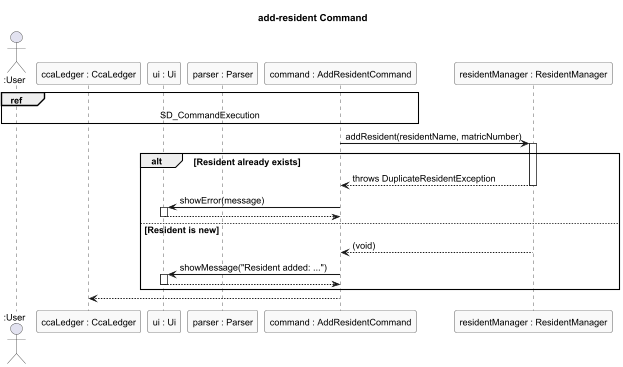

#### Design Considerations

This command follows the Command Pattern described in the [Architecture section](#overall-architecture).
Duplicate resident detection is handled inside `ResidentManager` using the matric number as a
unique identifier, keeping validation logic centralised in the manager layer.
---

### View Resident Command

#### Overview

The `view-resident` command displays the list of all residents stored in the system.

Format:
`view-resident`

---

#### Implementation

The `view-resident` command retrieves and displays all residents.

- The `Parser` creates a `ViewResidentCommand` object.
- `ViewResidentCommand.execute()` calls `ResidentManager.getResidentList()`.
- The retrieved list is passed to `Ui.showResidentList(...)` for display.


#### Sequence Diagram


---

### Delete Resident Command

#### Overview

The `delete-resident` command removes an existing resident from the system.

Format:
`delete-resident <matric number>`

---

#### Implementation

The `delete-resident` command is implemented using the Command pattern.

The `Parser` creates a `DeleteResidentCommand`.
`DeleteResidentCommand.execute()` retrieves the resident name using `ResidentManager.nameGivenMatricNumber(...).`
It then calls `ResidentManager.deleteResident(...)`.
If the resident does not exist, a ResidentNotFoundException is thrown and handled.


#### Sequence Diagram

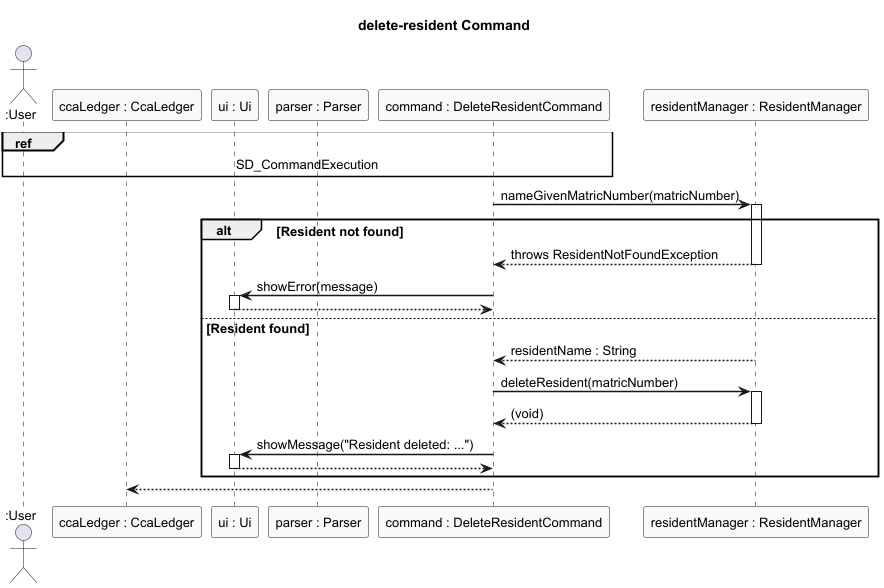

#### Design Considerations

This command follows the Command Pattern described in the [Architecture section](#overall-architecture).
The resident's name is retrieved before deletion to provide meaningful feedback to the user,
since the name would no longer be accessible after the delete operation completes.
---

### Add Resident to CCA Command

#### Overview

The `add-resident-to-cca` command adds an existing resident to a CCA.

Format:
`add-resident-to-cca <matric number>; <cca name> <points>`

---

#### Implementation

- The `Parser` creates a `AddResdientToCcaCommand` object.
- The command retrieves the `Resident` from `ResidentManager`.
- The corresponding `Cca` is retrieved from `CcaManager`.
- The `Resident` is added to the Cca using `Cca.addResidentToCca(...)`.
- Exceptions are thrown if the resident or CCA does not exist.


#### Sequence Diagram

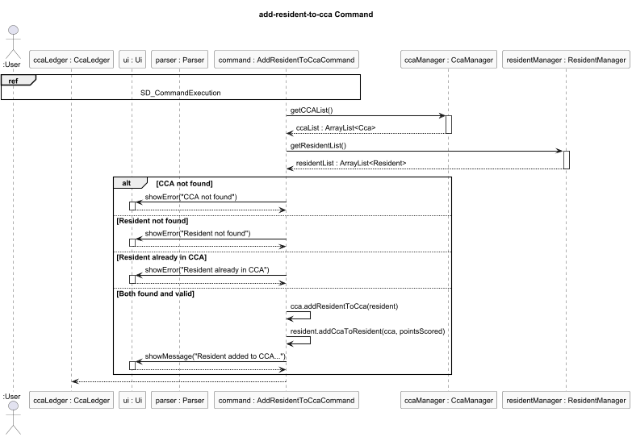

---
#### Design Considerations

This command follows the Command Pattern described in the [Architecture section](#overall-architecture).

### View Points Command

#### Overview

The view-points command displays the CCA points for all residents in the system.

Format:
view-points

---

#### Implementation

The view-points command retrieves and displays CCA points for all residents.

- The Parser creates a ViewPointsCommand object.
- ViewPointsCommand.execute() calls ResidentManager.getResidentList().
- The retrieved list is passed to Ui.showCcaPoints(...) for display.


#### Sequence Diagram

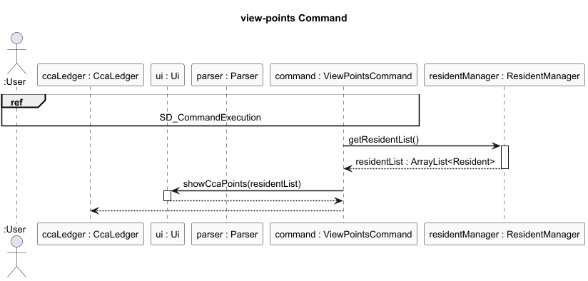

#### Design Considerations

This command follows the Command Pattern described in the [Architecture section](#overall-architecture).


### Resident Statistics Command

#### Overview

The `resident-stats` command displays the total points for each resident and the most active residents across all CCAs

Format:
`resident-stats`

---

#### Implementation

- The `Parser` creates a `ResidentStatsCommand` object.
- `ResidentStatsCommand.totalPoints()` computes the total points for each resident.
- `ResdientStatsCommand.mostActiveResidents()` finds the most active residents across all CCAs based on their total points.
- If there are no residents in the first place, `ResidentStatsCommand.execute()`passes a message to the user through `Ui.showMessage()`. Otherwise, it passes the above information to `Ui.showResidentStats()` for display.


#### Sequence Diagram
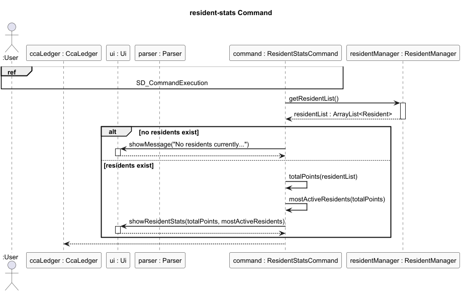

---
#### Design Considerations

This command follows the Command Pattern described in the [Architecture section](#overall-architecture).

### Update Point Command

#### Overview

The `update-point` command updates the points of a resident for a specified CCA.

Format:  
`update-point <matric number> <cca name> <points>`

---

#### Implementation

The `update-point` command retrieves the specified resident and CCA, then updates the resident’s points for that CCA.

The `Parser` creates an `UpdateCcaPointCommand` object from user input. `UpdateCcaPointCommand.execute()` retrieves the matching `Resident` from `ResidentManager` and the matching `Cca` from `CcaManager`. It then calls `Resident.updatePoint(cca, point)` to replace the resident’s existing point value for that CCA. After the update is completed, a success message is displayed through the `Ui`.

If the resident or CCA cannot be found, the command catches the corresponding exception and displays an error message.

#### Sequence Diagram
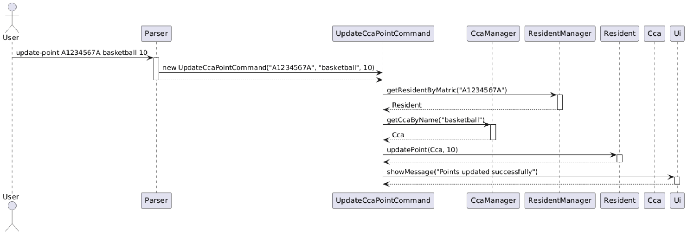

---

#### Design Considerations

This command follows the Command Pattern described in the [Architecture section](#overall-architecture).

The update logic is delegated to the `Resident` class through `Resident.updatePoint(...)`, which keeps the point mutation logic encapsulated within the entity that owns the data.

---
### Sort Points Command

#### Overview

The `sort-points` command sorts residents in descending order of total CCA points and displays the sorted list.

Format:  
`sort-points`

---

#### Implementation

The `sort-points` command retrieves the resident list from `ResidentManager`, sorts it according to total points, and displays the result.

The `Parser` creates a `SortPointsCommand` object from user input. `SortPointsCommand.execute()` retrieves the list of residents from `ResidentManager` and sorts it in descending order using each resident’s total points. The sorted list is then passed to `Ui.showCcaPoints(...)` for display.

If there are no residents in the system, the command displays an appropriate message instead.

#### Sequence Diagram
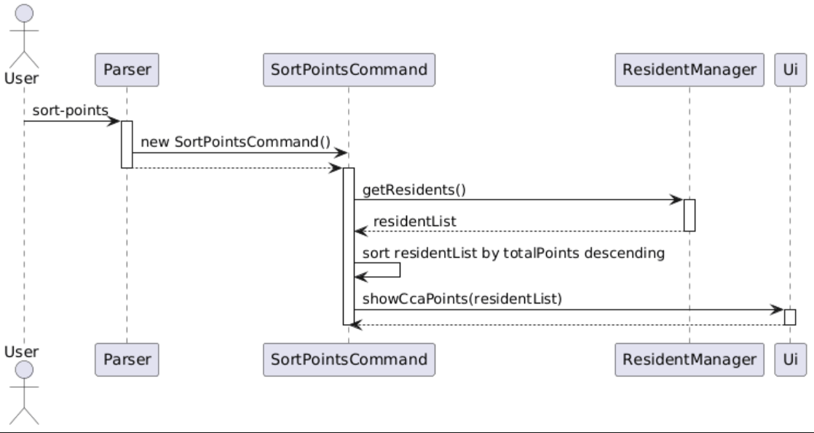

---

#### Design Considerations

This command follows the Command Pattern described in the [Architecture section](#overall-architecture).

The sorting is performed at command level instead of within the `Ui`, so that presentation logic remains separate from business logic.

## Event Commands

### Add Event Command

#### Overview

The `add-event` command adds a new event under a specified CCA.

Format:
`add-event <event name>; <cca name>; <date/time>`

---

#### Implementation

The `add-event` command is implemented using the Command pattern.

- The `Parser` creates an `AddEventCommand` object from user input.
- `AddEventCommand.execute()` retrieves the corresponding CCA from `CcaManager`.
- The event is added using `EventManager.addEvent(...)`.
- If the CCA does not exist, a `CcaNotFoundException` is thrown and handled.


#### Sequence Diagram
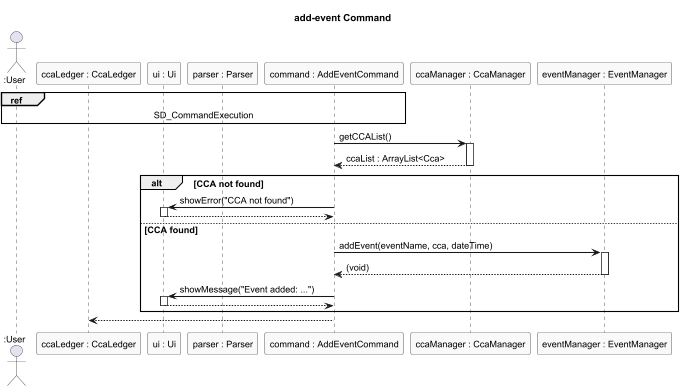


#### Design Considerations

This command follows the Command Pattern described in the [Architecture section](#overall-architecture).
The CCA lookup is performed inside the command before delegating to `EventManager`, ensuring
that events are never created under a non-existent CCA. `EventManager` itself remains
unaware of `CcaManager`, preserving the separation between managers.
---

### Add Resident to Event Command

#### Overview

The `add-resident-to-event` command adds an existing resident to a specific event under a CCA.

Format:
`add-resident-to-event <matric number>; <event name>; <cca name>`

---

#### Implementation

The command is implemented using the Command pattern.

- The `Parser` creates an `AddResidentToEventCommand`.
- The command retrieves the `Resident` from `ResidentManager`.
- The corresponding `Cca` is retrieved from `CcaManager`.
- The resident is added to the event using `EventManager.addResidentToEvent(...)`.
- Exceptions are thrown if the resident, CCA, or event does not exist.


#### Sequence Diagram

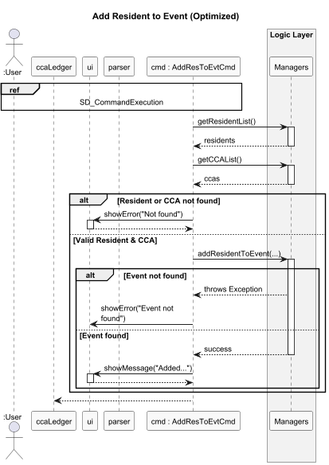

---

#### Design Considerations

This command follows the Command Pattern described in the [Architecture section](#overall-architecture).
This command is the most compositional in the system — it coordinates all three managers.
The resident and CCA lookups are resolved first in the command layer before delegating
the event lookup to `EventManager`, ensuring each manager only handles its own domain.
Note that `EventNotFoundException` sits outside the `CcaLedgerException` hierarchy by design
— see the [Exception Handling](#exception-handling) section for details.

### View My Events Command

#### Overview

The `view-my-events` command displays all events that a resident is participating in.

Format:  
`view-my-events <matric number>`

---

#### Implementation

The `view-my-events` command retrieves and displays all events associated with a resident.

The `Parser` creates a `ViewMyEvents` object from user input. `ViewMyEvents.execute()` calls `EventManager.viewMyEvents(matricNumber)` to retrieve the matching events. It then retrieves the resident using `ResidentManager.matchingResident(...)`, prints a greeting using the resident's name, and passes the event list to `Ui.viewMyCcas(...)` for display.


#### Sequence Diagram
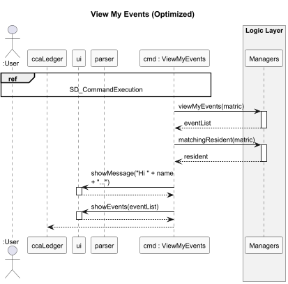

#### Design Considerations

This command follows the Command Pattern described in the [Architecture section](#overall-architecture).

---

### View CCA Events Command

#### Overview

The `view-cca-events` command displays all events under a specified CCA.

Format:  
`view-cca-events <cca name>`

---

#### Implementation

The `view-cca-events` command retrieves and displays all events belonging to a specific CCA.

The `Parser` creates a `ViewCcaEvents` object from user input. `ViewCcaEvents.execute()` calls `EventManager.viewCcaEvents(ccaName)` to retrieve the matching events, and the resulting list is passed to `Ui.viewMatchingCcas(...)` for display.


#### Sequence Diagram
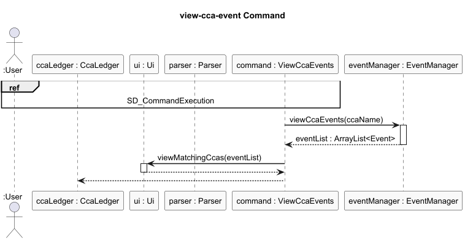

---
#### Design Considerations

This command follows the Command Pattern described in the [Architecture section](#overall-architecture).

## General Commands

### Help Command

#### Overview
The `help` command presents a list of all available commands and their usage.

Format:
`help`

#### Implementation

> The `help` command requires no manager interaction. It constructs a static help string
> and passes it directly to `Ui.showMessage()`. No sequence diagram is provided as the
> flow is fully captured by the
> [common execution reference](#reference-common-command-execution-flow).

# Appendices

---

## Appendix A: Product Scope

### Target User Profile

- Hall Leaders / CCA Leaders
- Manage multiple CCAs and events
- Track resident participation and performance
- Prefer a fast, CLI-based tool over GUI applications
- Need quick access to statistics and summaries

### Value Proposition

- Centralised management of CCAs, residents, and events
- Efficient tracking of participation and points
- Quick retrieval of statistics for decision making
- Lightweight and fast CLI interface

---

## Appendix B: User Stories

| Priority | As a ... | I want to ... | So that I can ... |
|----------|----------|--------------|-------------------|
| High | Hall Leader | add a CCA | manage different clubs |
| High | Hall Leader | delete a CCA | remove inactive clubs |
| High | Hall Leader | view CCAs | see all available clubs |
| High | Hall Leader | add a resident | keep track of participants |
| High | Hall Leader | delete a resident | remove inactive members |
| High | Hall Leader | view residents | see all participants |
| High | Hall Leader | add an event | organize activities |
| High | Hall Leader | add residents to events | track participation |
| High | Hall Leader | view events under a CCA | monitor activities |
| Medium | Hall Leader | assign EXCO roles | manage leadership |
| Medium | Hall Leader | view EXCO members | track leadership structure |
| Medium | Hall Leader | view points | track performance |
| Medium | Hall Leader | view statistics | analyze engagement |
| Low | Hall Leader | view my events | track individual participation |

---

## Appendix C: Non-Functional Requirements

1. **Usability**
   - The system should be easy to use via CLI commands.
   - Commands should follow a consistent format.

2. **Performance**
   - The application should respond within 1 second for typical commands.

3. **Reliability**
   - Data should persist between sessions.
   - The system should handle invalid inputs gracefully.

4. **Portability**
   - The application should run on any system with Java 17 or above.

5. **Maintainability**
   - Code should be modular and easy to extend.

6. **Scalability**
   - The system should handle increasing numbers of residents, CCAs, and events without significant slowdown.

---

## Appendix D: Glossary

| Term | Meaning |
|------|--------|
| CCA | Co-Curricular Activity |
| Resident | A student participating in CCAs |
| EXCO | Executive Committee member of a CCA |
| Matric Number | Unique identifier for a resident |
| Event | Activity organized under a CCA |
| Points | Score assigned based on participation |
| CLI | Command Line Interface |

---

## Appendix E: Instructions for Manual Testing

### Overview

This section provides a guided path for testers to explore the main features of the application.  
It complements the User Guide and focuses on key test flows.

---

### Initial Setup

1. Download the `.jar` file form the [GitHub Repo](https://github.com/AY2526S2-CS2113-W13-1/tp)
2. Double click the `.jar` file to launch the programme.

---

### Core Feature Testing Flow

#### 1. Add CCAs

```
add-cca Basketball; HIGH
add-cca Dance; LOW
```

---

#### 2. View CCAs

```
view-cca
```

---

#### 3. Add Residents

```
add-resident Ramesh; A1234567B
add-resident Suresh; A7654321C
```

---

#### 4. View Residents

```
view-resident
```

---

#### 5. Add Events

```
add-event Practice-Week1; Basketball; 29/3/26
add-event Orientation; Dance; 2/4/26
```

---

#### 6. Add Residents to Events

```
add-resident-to-event A1234567B; Practice-Week1; Basketball
add-resident-to-event A7654321C; Orientation Dance
```

---

#### 7. View Events

```
view-cca-events Basketball
view-my-events A1234567B
```

---

#### 8. Assign EXCO

```
add-exco-to-cca A1234567B; Basketball
view-exco Basketball
```

---

#### 9. View Points and Statistics

---

#### 10. Delete Operations

```
delete-resident A1234567B
delete-cca Basketball
```

---

## Exception Handling

### Overview

All custom exceptions in CcaLedger are defined under the `ccamanager.exceptions` package. The hierarchy is designed so that most exceptions can be caught uniformly via the base `CcaLedgerException`, while two special cases (`EventNotFoundException` and `DuplicateEventException`) sit outside that hierarchy for specific reasons.

---
### Exception Hierarchy

**`CcaLedgerException`** is the project's primary base class, extending Java's checked `Exception`. All domain-specific errors that commands are expected to catch and handle extend from it. This allows any command's `execute()` method to catch `CcaLedgerException` as a single fallback if needed, while still being able to handle individual subtypes for fine-grained messaging.
```java
public class CcaLedgerException extends Exception {
    public CcaLedgerException(String message) {
        super(message);
    }
}
```

**`EventNotFoundException`** extends `Exception` directly rather than `CcaLedgerException`. This is an intentional design choice to keep event-related lookup errors distinct from the broader CCA management error family.

**`DuplicateEventException`** extends `RuntimeException`, making it an *unchecked* exception. Unlike other duplicate-detection cases, this does not need to be declared in method signatures or explicitly caught — it surfaces as a programming error rather than a recoverable user input error.

---
### Exception Reference

| Exception | Parent | When thrown |
|---|---|---|
| `CcaLedgerException` | `Exception` | Base class — not thrown directly |
| `CcaNotFoundException` | `CcaLedgerException` | A CCA name does not match any stored CCA |
| `DuplicateCcaException` | `CcaLedgerException` | An `add-cca` command names a CCA that already exists |
| `InvalidCcaLevelException` | `CcaLedgerException` | The level argument is not one of `HIGH`, `MEDIUM`, `LOW`, `UNKNOWN` |
| `DuplicateResidentException` | `CcaLedgerException` | An `add-resident` command uses a matric number already in the system |
| `ResidentNotFoundException` | `CcaLedgerException` | A matric number does not match any stored resident |
| `ResidentAlreadyInCcaException` | `CcaLedgerException` | A resident is added to a CCA they already belong to |
| `InvalidCommandException` | `CcaLedgerException` | The parser receives input it cannot map to any command |
| `EventNotFoundException` | `Exception` | An event name does not match any stored event |
| `DuplicateEventException` | `RuntimeException` | An event with the same name already exists (unchecked) |

---

### Design Considerations

This command follows the Command Pattern described in the Architecture section. Parsing and execution are fully separated; the command stores no state and receives all dependencies through `execute()`.


### Input Validation vs. Exception Handling

CcaLedger uses two distinct layers of error handling, which work together:

**Layer 1 — `Parser` (structural validation):** Before any command object is created, `Parser.parse()` checks that the correct number of arguments is present and that no argument is blank. If validation fails, it returns an `UnknownCommand` with a usage hint rather than throwing an exception. No domain exceptions are involved at this stage.

For example, `add-cca` is validated in the parser as follows:
```java
case "add-cca":
    if (parts.length < 3 || parts[1].isBlank() || parts[2].isBlank()) {
        return new UnknownCommand("Usage: add-cca <cca name> <level>");
    }
    String name = parts[1];
    CcaLevel level = getCcaLevel(parts[2]);
    return new AddCcaCommand(name, level);
```

The `getCcaLevel()` helper also silently falls back to `CcaLevel.UNKNOWN` when an unrecognised level string is entered, logging a warning rather than surfacing an error to the user at parse time.

**Layer 2 — `Command.execute()` (domain validation):** Once a valid command object reaches `execute()`, domain exceptions are thrown by the manager or model layer if business rules are violated (e.g. duplicate CCA, resident not found). These are caught inside `execute()` and displayed to the user via `Ui.showError()`.

The `CcaLedger` run loop itself is intentionally kept free of any exception handling — it only coordinates parsing and execution, delegating all error display to `Ui`:
```java
while (isRunning) {
    String input = ui.readInput();
    Command command = parser.parse(input);
    command.execute(ccaManager, residentManager, eventManager, ui);
    isRunning = !command.isExit();
}
```

This separation ensures that `Parser` never needs to know about domain state, and `CcaLedger` never needs to know about error formatting.

---

### Where Each Exception Is Used

| Exception | Commands involved | Triggered by |
|---|---|---|
| `CcaNotFoundException` | `AddCcaCommand`, `DeleteCcaCommand`, `AddEventCommand`, `AddResidentToCcaCommand`, `AddExcoToCcaCommand`, `AddResidentToEventCommand`, `ViewCcaExco` | CCA name not matching any stored CCA |
| `DuplicateCcaException` | `AddCcaCommand` | `CcaManager.addCCA()` when the CCA name already exists |
| `InvalidCcaLevelException` | `AddCcaCommand` | `CcaManager.addCCA()` when the level string is invalid; `Parser.getCcaLevel()` falls back to `UNKNOWN` silently before this point |
| `DuplicateResidentException` | `AddResidentCommand` | `ResidentManager.addResident()` when the matric number already exists |
| `ResidentNotFoundException` | `DeleteResidentCommand`, `AddResidentToCcaCommand`, `AddExcoToCcaCommand`, `AddResidentToEventCommand` | Matric number not matching any stored resident |
| `ResidentAlreadyInCcaException` | `AddResidentToCcaCommand`, `AddExcoToCcaCommand` | `Cca.addResidentToCca()` when the resident already belongs to that CCA |
| `InvalidCommandException` | `Parser` | Input that cannot be mapped to any known command; `Parser` returns `UnknownCommand` in most cases instead of throwing |
| `EventNotFoundException` | `AddResidentToEventCommand` | `EventManager.addResidentToEvent()` when the event name does not match any stored event |
| `DuplicateEventException` | `EventManager` | `EventManager.addEvent()` when an event with the same name already exists; unchecked, so not declared in method signatures |


## Data Storage

### Overview

CcaLedger persists all application state to plain text files stored in a `data/` directory. The storage layer is implemented entirely within `StorageManager`, which is the only class that performs file I/O. No manager or command class reads from or writes to disk directly.

The `data/` directory is created automatically on first run if it does not exist. All five files are also created automatically — there is no manual setup required.

---

### Architecture

The storage layer sits beneath the Manager layer and is orchestrated by `CcaLedger`:
```
CcaLedger
    │
    ├── storage.load()   ← called once on startup, before showWelcome()
    │       │
    │       └── populates CcaManager, ResidentManager, EventManager
    │
    └── storage.save()   ← called after every mutating command
            │
            └── snapshots all manager state to disk
```

`StorageManager` has no dependency on `Ui`, `Parser`, or any `Command` class. It only depends on the three managers and the domain model.

---

### File Layout
```
data/
├── ccas.txt               — CCA entity table
├── residents.txt          — Resident entity table
├── events.txt             — Event entity table (FK → ccas.txt)
├── memberships.txt        — Resident ↔ CCA join table
└── event_attendance.txt   — Resident ↔ Event join table
```

All files use **pipe (`|`) as the column delimiter**. Literal pipe characters inside field values are escaped as `\|`, and literal backslashes are escaped as `\\`, so values round-trip without corruption.

---

### File Formats

#### `ccas.txt` — CCA entity table

One row per CCA.

| Column | Description |
|--------|-------------|
| `name` | Display name of the CCA |
| `level` | `CcaLevel` enum value: `HIGH`, `MEDIUM`, `LOW` |
```
Basketball|HIGH
Chess|HALL
Drama|LOW
```

---

#### `residents.txt` — Resident entity table

One row per resident.

| Column | Description |
|--------|-------------|
| `name` | Full name of the resident |
| `matricNumber` | Unique matric number (primary key) |
```
Alice Tan|A1234567X
Bob Lee|A7654321Y
```

---

#### `events.txt` — Event entity table

One row per event. `ccaName` is a foreign key referencing `ccas.txt`.

| Column | Description |
|--------|-------------|
| `eventName` | Name of the event |
| `ccaName` | FK → `ccas.txt` name column |
| `eventDate` | Date/time string as entered by the user |
```
AGM|Basketball|2025-04-01
Finals|Chess|2025-05-10
```

---

#### `memberships.txt` — Resident ↔ CCA join table

One row per resident-CCA membership. This table captures the many-to-many relationship between residents and CCAs, along with two attributes that belong to the relationship itself: points earned and EXCO status.

| Column | Description |
|--------|-------------|
| `matricNumber` | FK → `residents.txt` matricNumber |
| `ccaName` | FK → `ccas.txt` name |
| `points` | Points earned by this resident in this CCA |
| `isExco` | `true` if the resident is an EXCO of this CCA |
```
A1234567X|Basketball|50|false
A1234567X|Chess|30|true
A7654321Y|Basketball|20|false
```

> A resident who is an EXCO (`isExco=true`) is also a regular member of the CCA. On load, the resident is added to both `cca.registeredResidents` and `cca.excoMembers`.

---

#### `event_attendance.txt` — Resident ↔ Event join table

One row per resident-event attendance record. `ccaName` is included alongside `eventName` because event names are not globally unique — two different CCAs may both hold an event called "AGM". Together, `(eventName, ccaName)` form a composite foreign key back to `events.txt`.

| Column | Description |
|--------|-------------|
| `matricNumber` | FK → `residents.txt` matricNumber |
| `eventName` | Composite FK part 1 → `events.txt` eventName |
| `ccaName` | Composite FK part 2 → `events.txt` ccaName |
```
A1234567X|AGM|Basketball
A7654321Y|AGM|Basketball
A1234567X|Finals|Chess
```

---

### Save Behaviour

`StorageManager.save()` is called by `CcaLedger` after every command for which `command.isReadOnly()` returns `false`. It performs a **full snapshot** — all five files are overwritten from scratch on every save. This guarantees the files always reflect the exact current in-memory state.
```java
// In CcaLedger.run()
if (!command.isReadOnly()) {
    storage.save(ccaManager, residentManager, eventManager);
}
```

Read-only commands (all `view-*`, `cca-stats`, `resident-stats`, `help`) override `isReadOnly()` to return `true`, skipping the save step entirely to avoid unnecessary disk writes.

---

### Load Behaviour

`StorageManager.load()` is called once at startup, before `ui.showWelcome()`. It reads all five files and reconstructs the full in-memory state in the managers.

**Load order is critical** because later files contain foreign keys that reference entities defined in earlier files:

| Order | File | Dependencies |
|-------|------|-------------|
| 1 | `ccas.txt` | None |
| 2 | `residents.txt` | None |
| 3 | `events.txt` | CCAs must exist first |
| 4 | `memberships.txt` | CCAs and Residents must exist first |
| 5 | `event_attendance.txt` | Events and Residents must exist first |

If a file does not exist (e.g. on first run), the load method for that file returns immediately without error.

---

### FK Resolution on Load

When loading `events.txt`, `memberships.txt`, and `event_attendance.txt`, `StorageManager` must look up existing in-memory objects by their string identifiers. Three finder methods support this:

| Method | Class | Looks up by |
|--------|-------|-------------|
| `CcaManager.findByName(String)` | `CcaManager` | CCA name (case-insensitive) |
| `ResidentManager.findByMatric(String)` | `ResidentManager` | Matric number (case-insensitive) |
| `EventManager.findByNameAndCca(String, String)` | `EventManager` | Event name + CCA name (composite, case-insensitive) |

If a FK cannot be resolved (e.g. a CCA was deleted but a stale row remains in `memberships.txt`), the row is **skipped with a warning log** rather than crashing the application. This makes the storage layer resilient to manual edits or partial corruption.

---

### Membership Load Detail

Loading a membership row requires updating state in two places — the `Resident` and the `Cca`:
```java
// Resident side — adds CCA to the resident's parallel ccas + points lists
resident.addCcaToResident(cca, points);

// CCA side — registers the resident in the CCA's member list
cca.addResidentToCca(resident);

// If isExco, also add to the exco list directly
if (isExco) {
    cca.getExcos().add(resident);
}
```

> `addExcoToCca()` is intentionally **not** used during load. That method internally calls `addResidentToCca()`, which would throw `ResidentAlreadyInCcaException` since we already called it on the line above. Instead, exco status is restored by adding directly to the exco list after the member registration.

---

### Escape / Unescape

Field values are escaped before writing and unescaped after reading to prevent pipe characters inside values from breaking the column parser:

| Raw value | Stored as |
|-----------|-----------|
| `Hall \| Drama` | `Hall \\\| Drama` |
| `back\slash` | `back\\\\slash` |

Backslashes are escaped first, then pipes, so the two operations never interfere with each other. Unescaping reverses this — pipes first, then backslashes.

---

### Error Resilience

Every load method follows the same defensive pattern:

- If the file does not exist → return silently (first run case)
- If a line has too few fields → log a warning, skip the line
- If a FK cannot be resolved → log a warning, skip the line
- If a value fails to parse (e.g. non-integer points) → log a warning, skip the line
- If a duplicate is detected → catch the exception, log a warning, skip the line

This means a single corrupt row never prevents the rest of the file from loading.

---

### Sequence Diagram — Save
```
CcaLedger          Command            StorageManager
    │                  │                    │
    │  execute(...)     │                    │
    │─────────────────>│                    │
    │                  │                    │
    │<─────────────────│                    │
    │  [isReadOnly=false]                   │
    │  save(ccaManager, residentManager,    │
    │       eventManager)                   │
    │──────────────────────────────────────>│
    │                  │    saveCcas()      │
    │                  │    saveResidents() │
    │                  │    saveEvents()    │
    │                  │    saveMemberships()
    │                  │    saveEventAttendance()
    │<──────────────────────────────────────│
```

---

### Sequence Diagram — Load
```
CcaLedger                    StorageManager
    │                               │
    │  load(ccaManager,             │
    │       residentManager,        │
    │       eventManager)           │
    │──────────────────────────────>│
    │                  loadCcas()   │──> populates CcaManager
    │                  loadResidents() > populates ResidentManager
    │                  loadEvents() │──> populates EventManager (resolves CCA FK)
    │                  loadMemberships() > links Residents ↔ CCAs
    │                  loadEventAttendance() > links Residents ↔ Events
    │<──────────────────────────────│
    │
    │  showWelcome()
```

---

### Design Considerations

**Why overwrite all files on every save?**
Simplicity and correctness. A full snapshot guarantees the files are never stale. For the scale of data this application handles (a single hall's CCAs and residents), the performance cost is negligible.

**Why separate join tables instead of embedding in entity files?**
A resident belongs to multiple CCAs with different point values. Embedding that in `residents.txt` would require a variable-length nested format that is significantly harder to parse and maintain. Separate join tables keep every file uniformly structured with a fixed number of columns per row.


## Product scope
### Target user profile
```
view-points
cca-stats
resident-stats
```

---


### Edge Cases to Try

- Adding duplicate CCAs
- Adding duplicate residents
- Adding events to non-existent CCAs
- Adding residents to non-existent events

---

## Acknowledgements

- No external code was directly reused unless otherwise stated.
- Standard Java libraries were used for implementation.


---

