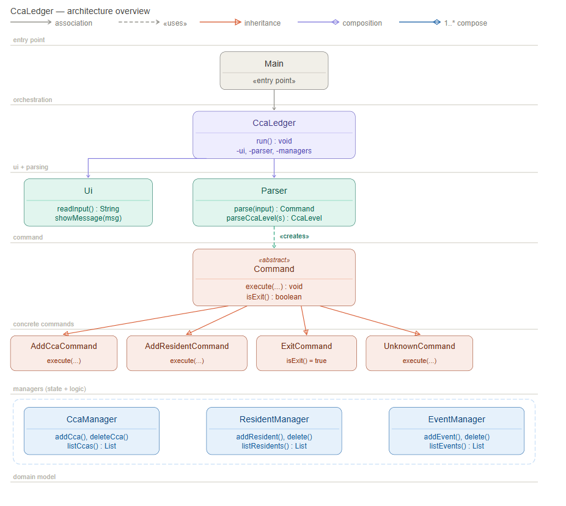
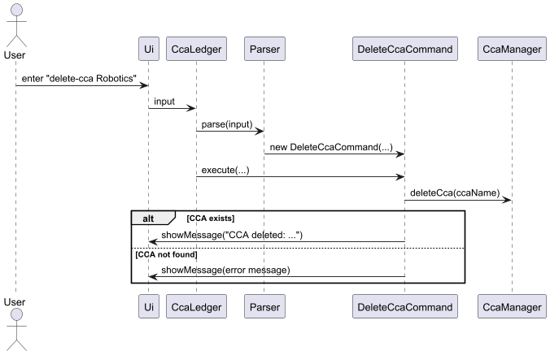
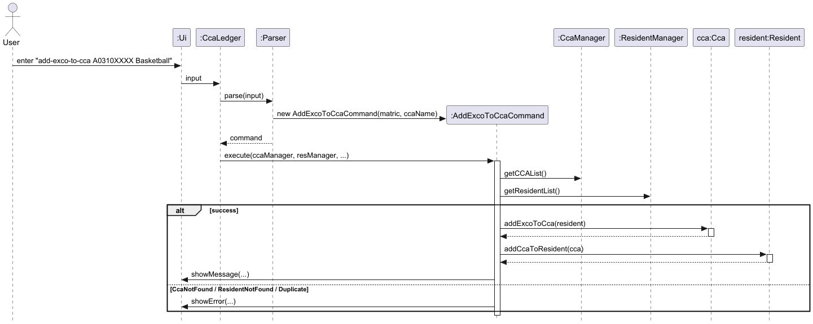
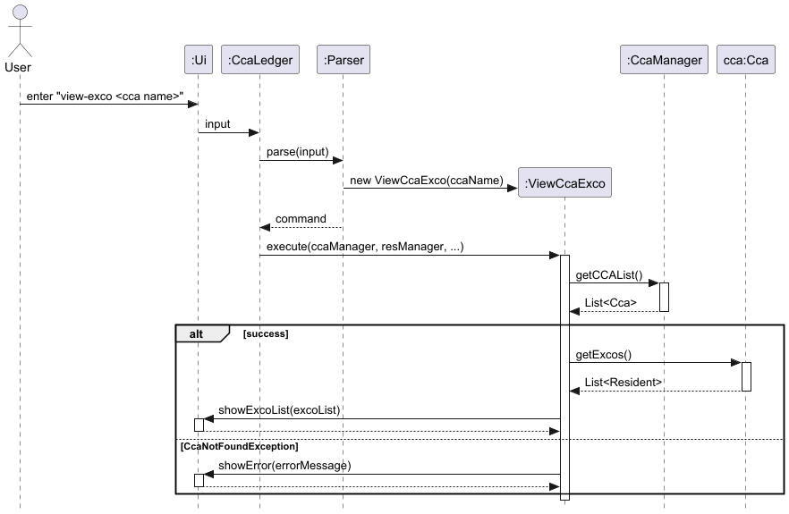
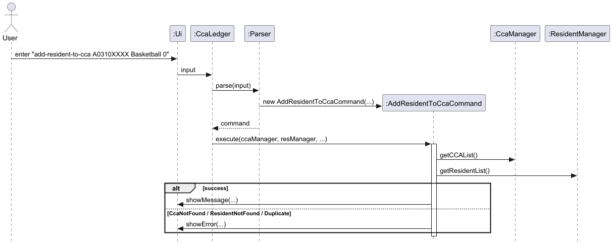
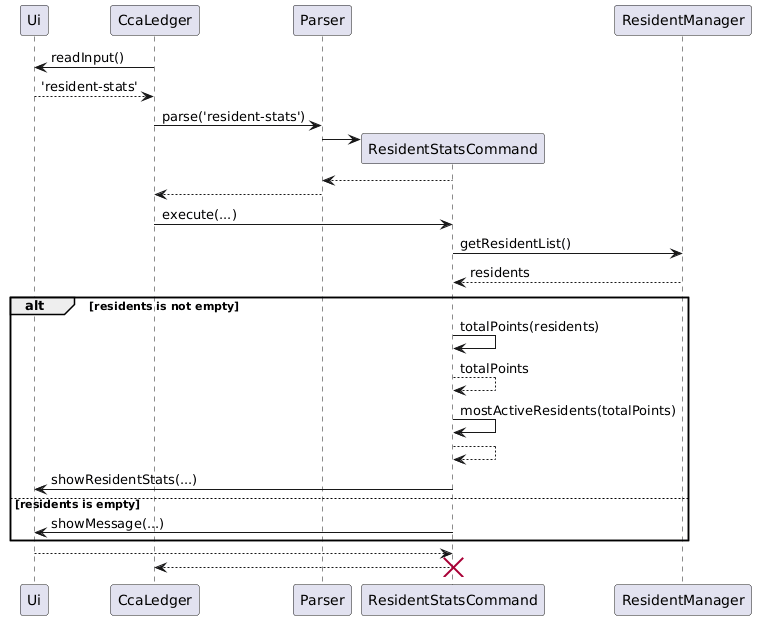
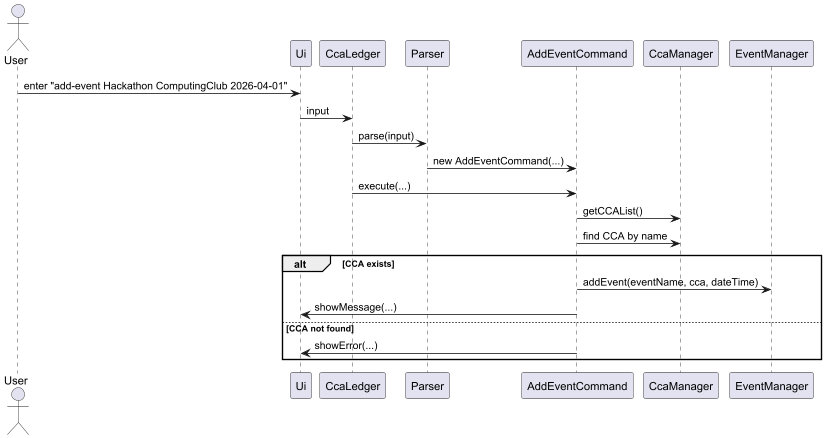
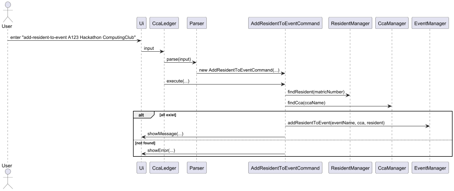

# Developer Guide

---

## Table of Contents

1. [Overall Architecture](#overall-architecture)
2. [CCA Commands](#cca-commands)
   - [Add CCA Command](#add-cca-command)
   - [View CCA Command](#view-cca-command)
   - [Delete CCA Command](#delete-cca-command)
   - [Add EXCO to CCA Command](#add-exco-to-cca-command)
   - [View all EXCOs of a CCA](#view-all-the-excos-of-a-cca)
   - [CCA Statistics Command](#cca-statistics-command)
3. [Resident Commands](#resident-commands)
   - [Add Resident Command](#add-resident-command)
   - [View Resident Command](#view-resident-command)
   - [Delete Resident Command](#delete-resident-command)
   - [Add Resident to CCA Command](#add-resident-to-cca-command)
   - [View Points Command](#view-points-command)
   - [Resident Statistics Command](#resident-statistics-command)
4. [Event Commands](#event-commands)
   - [Add Event Command](#add-event-command)
   - [Add Resident to Event Command](#add-resident-to-event-command)
   - [View My Events Command](#view-my-events-command)
   - [View CCA Events Command](#view-cca-events-command)
5. [General Commands](#general-commands)
   - [Help Command](#help-command)

---


## Quick Start

Follow the steps below to set up and run the application:

### Prerequisites
- Ensure that you have **Java 17** installed on your system.
- You can verify your Java version by running:
  ```
  java -version
  ```
- If the version is not Java 17, install it before proceeding.

---

### Download the Application
1. Go to the project repository:  
   https://github.com/AY2526S2-CS2113-W13-1/tp
2. Navigate to the **Releases** section.
3. Download the latest `.jar` file.

---

### Running the Application
1. Open a terminal/command prompt.
2. Navigate to the folder containing the `.jar` file.
3. Run the following command:
   ```
   java -jar CCAledger.jar
   ```

---

### First Run
- The application will start in the terminal.
- You can begin entering commands immediately.
- Use the following command to see available commands:
  ```
  help
  ```

---

### Notes
- Ensure that the `.jar` file is in the correct directory before running.
- If the application does not start, re-check your Java version and installation.
- All data will be stored locally in the same directory as the `.jar` file.


## Overall Architecture

CcaLedger follows a **layered, command-driven architecture**. Each layer has a single responsibility and communicates only with its immediate neighbours.



The diagram above shows the six layers and their relationships. The table below summarises each layer's role.

| Layer         | Key Classes                                     | Responsibility                                                |
|---------------|-------------------------------------------------|---------------------------------------------------------------|
| Entry Point   | `Main`                                          | Instantiates `CcaLedger` and calls `run()`.                   |
| Orchestration | `CcaLedger`                                     | Owns the main loop; coordinates all components.               |
| UI & Parsing  | `Ui`, `Parser`                                  | Handles console I/O; translates input into `Command` objects. |
| Command       | `Command` and subclasses                        | Encapsulates a single user-facing operation.                  |
| Managers      | `CcaManager`, `ResidentManager`, `EventManager` | Holds and mutates application state.                          |
| Domain Model  | `Cca`, `Resident`, `Event`, `CcaLevel`          | Plain data objects with no business logic.                    |

**How a command executes (happy path):**

1. `Ui.readInput()` reads a line from the user.
2. `Parser.parse(input)` inspects the string and returns the appropriate `Command` subclass.
3. `CcaLedger` calls `command.execute(ccaManager, residentManager, eventManager, ui)`.
4. The command calls the relevant manager method(s) and prints feedback via `Ui`.
5. If `command.isExit()` returns `true`, the loop terminates.

**Key design rules:**
- Domain objects (`Cca`, `Resident`, `Event`) have no outward dependencies.
- Managers never reference `Ui`, `Parser`, or `Command`.
- Commands receive all dependencies as method parameters in `execute()` — they store nothing.
- `Command` subclasses are only ever instantiated inside `Parser.parse()`.

---

## CCA Commands

### Add CCA Command

#### Overview

The `add-cca` command adds a new CCA to the system.

Format:
`add-cca <cca name> <level>`

---

#### Implementation

The `add-cca` command is implemented using the Command pattern.

- The `Parser` creates an `AddCcaCommand` object from user input.
- `AddCcaCommand.execute()` calls `CcaManager.addCCA(...)`.
- If the CCA already exists, a `DuplicateCcaException` is thrown and handled.

```java
@Override
public void execute(CcaManager ccaManager, ResidentManager residentManager, EventManager eventManager, Ui ui) {
   try {
      ccaManager.addCCA(ccaName, ccaLevel);
      ui.showMessage("CCA added: " + ccaName + "(" + ccaLevel + ")");
   } catch (DuplicateCcaException | InvalidCcaLevelException e) {
      ui.showError(e.getMessage());
   }
}
```

#### Sequence Diagram


#### Design Considerations

- Command pattern is used to separate parsing and execution.
- Exception handling is used to manage duplicate CCA cases cleanly

#### Alternatives Considered
1. Direct Invocation from Parser to Manager
   Approach: Parser directly calls `CcaManager.addCCA(...)`
   Rejected because:
- Violates separation of concerns
- Makes Parser overly complex
- Reduces extensibility

---

### View CCA Command

#### Overview

The `view-cca` command displays the list of all CCAs stored in the system.

Format:
`view-cca`

---

#### Implementation

The `view-cca` command retrieves and displays all CCAs.

- The `Parser` creates a `ViewCcaCommand` object.
- `ViewCcaCommand.execute()` calls `CcaManager.getCCAList()`.
- The retrieved list is passed to `Ui.showCcaList(...)` for display.

```java
@Override
public void execute(CcaManager ccaManager, ResidentManager residentManager, Ui ui) {
    ArrayList<Cca> ccaList = ccaManager.getCCAList();
    ui.showCcaList(ccaList);
}
```

#### Sequence Diagram


---

### Delete CCA Command

#### Overview

The `delete-cca` command removes an existing CCA from the system.

Format:
`delete-cca <cca name>`

---

#### Implementation

The `delete-cca` command is implemented using the Command pattern.

- The `Parser` creates a `DeleteCcaCommand` object from user input.
- `DeleteCcaCommand.execute()` calls `CcaManager.deleteCca(...)`.
- If the CCA does not exist, a `CcaNotFoundException` is thrown and handled.
```java
@Override
public void execute(CcaManager ccaManager, ResidentManager residentManager, Ui ui) {
    try {
        ccaManager.deleteCca(ccaName);
        ui.showMessage("CCA deleted: " + ccaName);
    } catch (CcaNotFoundException e) {
        ui.showMessage(e.getMessage());
    }
}
```

#### Sequence Diagram


#### Design Considerations

- Command pattern is used to separate parsing and execution.
- Exception handling is used to manage non-existent CCA cases cleanly.

#### Alternatives Considered
1. Direct Invocation from Parser to Manager  
   Approach: Parser directly calls `CcaManager.deleteCca(...)`  
   Rejected because:
   - Violates separation of concerns
   - Makes Parser overly complex
   - Reduces extensibility

---

### Add EXCO to CCA Command

#### Overview

The `add-exco-to-cca` command adds an existing resident as an EXCO for the Cca.

Format:
`add-exco-to-cca <matric number> <cca name>`

---

#### Implementation

- The `Parser` creates a `AddExcoToCcaCommand` object.
- The command retrieves the `Resident` from `ResidentManager`.
- The corresponding `Cca` is retrieved from `CcaManager`.
- The `Resident` is added to the Cca as an EXCO in the `excoResidents` arraylist.
- Exceptions are thrown if the resident or CCA does not exist.

```java
@Override
public void execute(CcaManager ccaManager, ResidentManager residentManager, EventManager eventManager, Ui ui) {
   try {
      Cca cca = ccaManager.getCCAList().stream()
              .filter(x -> x.getName().equals(ccaName))
              .findFirst()
              .orElseThrow(() -> new CcaNotFoundException(ccaName + " not found."));
   
      Resident resident = residentManager.getResidentList().stream()
              .filter(x -> x.getMatricNumber().equals(matriculationNo))
              .findFirst()
              .orElseThrow(() -> new ResidentNotFoundException(matriculationNo + " not found."));
   
      cca.addExcoToCca(resident);
      resident.addCcaToResident(cca);
   
      ui.showMessage("Resident " + resident + " was added as an EXCO to CCA: " + cca.getName());
   
   } catch (CcaNotFoundException | ResidentNotFoundException | ResidentAlreadyInCcaException e) {
      ui.showError(e.getMessage());
   }
}
```

#### Sequence Diagram



---

### View all the EXCOs of a CCA

#### Overview
The `view-exco` command display the list of EXCOs of an existing Cca.

Format:
`view-exco <cca name>`

#### Implementation

- The `Parser` creates a `ViewCcaExco` object.
- The command retrieves the `CcaList` from `CcaManager`.
- It checks if the `Cca` input is a part of `CcaList`
- If no it throws a `CcaNotFoundException`.
- If yes, then is displays the `excoMembers` of a `Cca`

```java
@Override
public void execute(CcaManager ccaManager, ResidentManager residentManager, EventManager eventManager, Ui ui) {
   try {
      Cca cca = ccaManager.getCCAList().stream()
              .filter(x -> x.getName().equals(ccaName))
              .findFirst()
              .orElseThrow(() -> new CcaNotFoundException(ccaName + " not found."));
      ui.showExcoList(cca.getExcos());
   } catch (CcaNotFoundException e) {
      ui.showError(e.getMessage());
   }
}
```

#### Sequence Diagram



---

### CCA Statistics Command

#### Overview

The `cca-stats` command displays the average points and most active member for each CCA as well as the most popular CCA based on the average points.

Format:
`cca-stats`

---

#### Implementation

- The `Parser` creates a `CcaStatsCommand` object.
- `CcaStatsCommand.avgPoints()` computes the average points for each CCA.
- `CcaStatsCommand.mostPopularCca()` finds the most popular CCA by finding the CCA with the highest average points.
- `CcaStatsCommand.mostActiveResidents()` finds the most active member of each CCA by taking the resident with the most points for that CCA.
- If there are no CCAs in the first place, `CcaStatsCommand.execute()` passes a message to the user through `Ui.showMessage()`. Otherwise, it passes the above information to `Ui.showCcaStats()` for display.

```java
@Override
public void execute(CcaManager ccaManager, ResidentManager residentManager, EventManager eventManager, Ui ui) {
   ArrayList<Cca> ccas = ccaManager.getCCAList();
   try {
      HashMap<Cca, Double> avgPoints = avgPoints(ccas);
      Cca mostPopularCca = mostPopularCca(avgPoints);
      HashMap<Cca, Resident> mostActiveResidents = mostActiveResidents(ccas);
      ui.showCcaStats(avgPoints, mostPopularCca, mostActiveResidents);
   } catch (IllegalArgumentException e) {
      ui.showMessage("There are no CCAs currently. Please add CCAs using add-cca command");
   }
}
```

#### Sequence Diagram


---

## Resident Commands

### Add Resident Command

#### Overview

The `add-resident` command adds a new resident to the system.

Format:  
`add-resident <resident name> <matric number>`

---

#### Implementation

The `add-resident` command is implemented using the Command pattern.

- The `Parser` creates an `AddResidentCommand` object from user input.
- `AddResidentCommand.execute()` calls `ResidentManager.addResident(...)`.
- If a resident with the same matric number already exists, a `DuplicateResidentException` is thrown and handled.

```java
@Override
public void execute(CcaManager ccaManager, ResidentManager residentManager, EventManager eventManager, Ui ui) {
   try {
      residentManager.addResident(residentName, matricNumber);
      ui.showMessage("Resident added: " + residentName + " " + matricNumber);
   } catch (DuplicateResidentException e) {
      ui.showError(e.getMessage());
   }
}
```

#### Sequence Diagram


#### Design Considerations
- Command pattern separates parsing and execution.
- Duplicate validation is handled inside ResidentManager, keeping business logic centralized.

---

### View Resident Command

#### Overview

The `view-resident` command displays the list of all residents stored in the system.

Format:
`view-resident`

---

#### Implementation

The `view-resident` command retrieves and displays all residents.

- The `Parser` creates a `ViewResidentCommand` object.
- `ViewResidentCommand.execute()` calls `ResidentManager.getResidentList()`.
- The retrieved list is passed to `Ui.showResidentList(...)` for display.

```java
@Override
 public void execute(CcaManager ccaManager, ResidentManager residentManager, Ui ui) {
     ArrayList<Resident> residentList = residentManager.getResidentList();
     ui.showResidentList(residentList);
 }
```

#### Sequence Diagram


---

### Delete Resident Command

#### Overview

The `delete-resident` command removes an existing resident from the system.

Format:
`delete-resident <matric number>`

---

#### Implementation

The `delete-resident` command is implemented using the Command pattern.

The `Parser` creates a `DeleteResidentCommand`.
`DeleteResidentCommand.execute()` retrieves the resident name using `ResidentManager.nameGivenMatricNumber(...).`
It then calls `ResidentManager.deleteResident(...)`.
If the resident does not exist, a ResidentNotFoundException is thrown and handled.

@Override
```java
public void execute(CcaManager ccaManager, ResidentManager residentManager, EventManager eventManager, Ui ui) {
try {
String residentName = residentManager.nameGivenMatricNumber(matricNumber);
residentManager.deleteResident(matricNumber);
ui.showMessage("Resident deleted: " + residentName);
} catch (ResidentNotFoundException e) {
ui.showMessage(e.getMessage());
}
}
```

#### Sequence Diagram


#### Design Considerations
- Delegates deletion logic fully to ResidentManager.
- Retrieves resident name before deletion for better user feedback.

---

### Add Resident to CCA Command

#### Overview

The `add-resident-to-cca` command adds an existing resident to a CCA.

Format:
`add-resident-to-cca <matric number> <cca name> <points>`

---

#### Implementation

- The `Parser` creates a `AddResdientToCcaCommmand` object.
- The command retrieves the `Resident` from `ResidentManager`.
- The corresponding `Cca` is retrieved from `CcaManager`.
- The `Resident` is added to the Cca using `Cca.addResidentToCca(...)`.
- Exceptions are thrown if the resident or CCA does not exist.

```java
@Override
 public void execute(CcaManager ccaManager, ResidentManager residentManager, EventManager eventManager, Ui ui) {
     try {
         Cca cca = ccaManager.getCCAList().stream()
                 .filter(x -> x.getName().equals(ccaName))
                 .findFirst()
                 .orElseThrow(() -> new CcaNotFoundException(ccaName + " not found."));

         Resident resident = residentManager.getResidentList().stream()
                 .filter(x -> x.getMatricNumber().equals(matriculationNo))
                 .findFirst()
                 .orElseThrow(() -> new ResidentNotFoundException(matriculationNo + " not found."));

         cca.addResidentToCca(resident);
         resident.addCcaToResident(cca, pointsScored);

         ui.showMessage("Resident " + resident + " was added to CCA: " + cca.getName() +
                 " with " + pointsScored + " points.");

     } catch (CcaNotFoundException | ResidentNotFoundException | ResidentAlreadyInCcaException e) {
         ui.showError(e.getMessage());
     }
 }
```

#### Sequence Diagram



---

### View Points Command

#### Overview

The view-points command displays the CCA points for all residents in the system.

Format:
view-points

---

#### Implementation

The view-points command retrieves and displays CCA points for all residents.

- The Parser creates a ViewPointsCommand object.
- ViewPointsCommand.execute() calls ResidentManager.getResidentList().
- The retrieved list is passed to Ui.showCcaPoints(...) for display.
```java
@Override
public void execute(CcaManager ccaManager, ResidentManager residentManager, Ui ui) {
ArrayList<Resident> residentList = residentManager.getResidentList();
ui.showCcaPoints(residentList);
}
```

#### Sequence Diagram


#### Design Considerations

- Command pattern is used to separate parsing and execution.
- Reuses ResidentManager.getResidentList() to retrieve resident data, keeping the manager layer lean.

---

### Resident Statistics Command

#### Overview

The `resident-stats` command displays the total points for each resident and the most active residents across all CCAs

Format:
`resident-stats`

---

#### Implementation

- The `Parser` creates a `ResidentStatsCommand` object.
- `ResidentStatsCommand.totalPoints()` computes the total points for each resident.
- `ResdientStatsCommand.mostActiveResidents()` finds the most active residents across all CCAs based on their total points.
- If there are no resdients in the first place, `ResidentStatsCommand.execute()`passes a message to the user through `Ui.showMessage()`. Otherwise, it passes the above information to `Ui.showResidentStats()` for display.

```java
@Override
public void execute(CcaManager ccaManager, ResidentManager residentManager, EventManager eventManager, Ui ui) {
   ArrayList<Resident> residents = residentManager.getResidentList();
   if (residents.isEmpty()) {
      ui.showMessage("There are no residents currently. Please add residents using add-resident command");
      return;
   }
   HashMap<Resident, Integer> totalPoints = totalPoints(residents);
   ArrayList<Resident> mostActiveResident = mostActiveResidents(totalPoints);
   ui.showResidentStats(totalPoints, mostActiveResident);
}
```

#### Sequence Diagram


---

## Event Commands

### Add Event Command

#### Overview

The `add-event` command adds a new event under a specified CCA.

Format:
`add-event <event name> <cca name> <date/time>`

---

#### Implementation

The `add-event` command is implemented using the Command pattern.

- The `Parser` creates an `AddEventCommand` object from user input.
- `AddEventCommand.execute()` retrieves the corresponding CCA from `CcaManager`.
- The event is added using `EventManager.addEvent(...)`.
- If the CCA does not exist, a `CcaNotFoundException` is thrown and handled.

```java
@Override
public void execute(CcaManager ccaManager, ResidentManager residentManager, EventManager eventManager, Ui ui) {
   try {
      Cca cca = ccaManager.getCCAList().stream()
              .filter(x -> x.getName().equals(ccaName))
              .findFirst()
              .orElseThrow(() -> new CcaNotFoundException(ccaName + " not found."));

      eventManager.addEvent(eventName, cca, dateTime);

      ui.showMessage("Event added: " + eventName + " for the CCA " + ccaName + ", during " + dateTime);

   } catch (CcaNotFoundException e) {
      ui.showError(e.getMessage());
   }
}
```

#### Sequence Diagram


---

### Add Resident to Event Command

#### Overview

The `add-resident-to-event` command adds an existing resident to a specific event under a CCA.

Format:
`add-resident-to-event <matric number> <event name> <cca name>`

---

#### Implementation

The command is implemented using the Command pattern.

- The `Parser` creates an `AddResidentToEventCommand`.
- The command retrieves the `Resident` from `ResidentManager`.
- The corresponding `Cca` is retrieved from `CcaManager`.
- The resident is added to the event using `EventManager.addResidentToEvent(...)`.
- Exceptions are thrown if the resident, CCA, or event does not exist.

```java
@Override
public void execute(CcaManager ccaManager, ResidentManager residentManager, EventManager eventManager, Ui ui) {
   try {
      Resident resident = residentManager.getResidentList().stream()
              .filter(r -> r.getMatricNumber().equalsIgnoreCase(matricNumber))
              .findFirst()
              .orElseThrow(() -> new ResidentNotFoundException(...));

      Cca cca = ccaManager.getCCAList().stream()
              .filter(c -> c.getName().equalsIgnoreCase(ccaName))
              .findFirst()
              .orElseThrow(() -> new CcaNotFoundException(...));

      eventManager.addResidentToEvent(eventName, cca, resident);

      ui.showMessage(...);

   } catch (ResidentNotFoundException | CcaNotFoundException | EventNotFoundException e) {
      ui.showError(e.getMessage());
   }
}
```

#### Sequence Diagram



---

### View My Events Command

#### Overview

The `view-my-event` command displays all events that a resident is participating in.

Format:  
`view-my-event <matric number>`

---

#### Implementation

The `view-my-event` command retrieves and displays all events associated with a resident.

The `Parser` creates a `ViewMyEvents` object from user input. `ViewMyEvents.execute()` calls `EventManager.viewMyEvents(matricNumber)` to retrieve the matching events. It then retrieves the resident using `ResidentManager.matchingResident(...)`, prints a greeting using the resident's name, and passes the event list to `Ui.viewMyCcas(...)` for display.

```java
@Override
public void execute(CcaManager ccaManager, ResidentManager residentManager, EventManager eventManager, Ui ui) {
    ArrayList<Event> ccaEvents = eventManager.viewMyEvents(matricNumber);
    Resident resident = residentManager.matchingResident(matricNumber);
    System.out.println("Hi " + resident.getName() + ", here are your events: ");
    ui.viewMyCcas(ccaEvents);
}
```

#### Sequence Diagram


---

### View CCA Events Command

#### Overview

The `view-cca-event` command displays all events under a specified CCA.

Format:  
`view-cca-event <cca name>`

---

#### Implementation

The `view-cca-event` command retrieves and displays all events belonging to a specific CCA.

The `Parser` creates a `ViewCcaEvents` object from user input. `ViewCcaEvents.execute()` calls `EventManager.viewCcaEvents(ccaName)` to retrieve the matching events, and the resulting list is passed to `Ui.viewMatchingCcas(...)` for display.

```java
@Override
public void execute(CcaManager ccaManager, ResidentManager residentManager, EventManager eventManager, Ui ui){
    ArrayList<Event> ccaEvents = eventManager.viewCcaEvents(ccaName);
    ui.viewMatchingCcas(ccaEvents);
}
```

#### Sequence Diagram


---

## General Commands

### Help Command

#### Overview
The `help` command presents a list of all available commands and their usage.

Format:
`help`

#### Implementation
The `help` command is implemented using the Command pattern.

- The `Parser` creates a `HelpCommand` object from user input.
- `HelpCommand.execute()` creates a string which is a list of all commands and their usage.
- It then passes the string to `Ui.showMessage()`.

```java
@Override
 public void execute(CcaManager ccaManager, ResidentManager residentManager, EventManager eventManager, Ui ui) {
    String help = "Here is a list of all commands:\n" +
            "> add-cca <cca name> <level (HIGH, MEDIUM, LOW or UNKNOWN)>\n" +
            "> view-cca\n" +
            "> delete-cca <cca name>\n" +
            "> add-event <event name> <cca name> <data time>\n" +
            "> add-resident <name> <matric number>\n" +
            "> view-resident\n" +
            "> add-resident-to-cca <matric number> <cca name> <points>\n" +
            "> add-resident-to-event <matric number> <event name> <cca name>\n" +
            "> view-points\n" +
            "> cca-stats\n" +
            "> resident-stats\n" +
            "> help\n" +
            "> bye";
    ui.showMessage(help);
}
 ```


# Appendices

---

## Appendix A: Product Scope

### Target User Profile

- Hall Leaders / CCA Leaders
- Manage multiple CCAs and events
- Track resident participation and performance
- Prefer a fast, CLI-based tool over GUI applications
- Need quick access to statistics and summaries

### Value Proposition

- Centralised management of CCAs, residents, and events
- Efficient tracking of participation and points
- Quick retrieval of statistics for decision making
- Lightweight and fast CLI interface

---

## Appendix B: User Stories

| Priority | As a ... | I want to ... | So that I can ... |
|----------|----------|--------------|-------------------|
| High | Hall Leader | add a CCA | manage different clubs |
| High | Hall Leader | delete a CCA | remove inactive clubs |
| High | Hall Leader | view CCAs | see all available clubs |
| High | Hall Leader | add a resident | keep track of participants |
| High | Hall Leader | delete a resident | remove inactive members |
| High | Hall Leader | view residents | see all participants |
| High | Hall Leader | add an event | organize activities |
| High | Hall Leader | add residents to events | track participation |
| High | Hall Leader | view events under a CCA | monitor activities |
| Medium | Hall Leader | assign EXCO roles | manage leadership |
| Medium | Hall Leader | view EXCO members | track leadership structure |
| Medium | Hall Leader | view points | track performance |
| Medium | Hall Leader | view statistics | analyze engagement |
| Low | Hall Leader | view my events | track individual participation |

---

## Appendix C: Non-Functional Requirements

1. **Usability**
   - The system should be easy to use via CLI commands.
   - Commands should follow a consistent format.

2. **Performance**
   - The application should respond within 1 second for typical commands.

3. **Reliability**
   - Data should persist between sessions.
   - The system should handle invalid inputs gracefully.

4. **Portability**
   - The application should run on any system with Java 17 or above.

5. **Maintainability**
   - Code should be modular and easy to extend.

6. **Scalability**
   - The system should handle increasing numbers of residents, CCAs, and events without significant slowdown.

---

## Appendix D: Glossary

| Term | Meaning |
|------|--------|
| CCA | Co-Curricular Activity |
| Resident | A student participating in CCAs |
| EXCO | Executive Committee member of a CCA |
| Matric Number | Unique identifier for a resident |
| Event | Activity organized under a CCA |
| Points | Score assigned based on participation |
| CLI | Command Line Interface |

---

## Appendix E: Instructions for Manual Testing

### Overview

This section provides a guided path for testers to explore the main features of the application.  
It complements the User Guide and focuses on key test flows.

---

### Initial Setup

1. Download the `.jar` file form the [GitHub Repo](https://github.com/AY2526S2-CS2113-W13-1/tp)
2. Double click the `.jar` file to launch the programme.

---

### Core Feature Testing Flow

#### 1. Add CCAs

```
add-cca Basketball HIGH
add-cca Dance LOW
```

---

#### 2. View CCAs

```
view-cca
```

---

#### 3. Add Residents

```
add-resident John A1234567B
add-resident James A7654321C
```

---

#### 4. View Residents

```
view-resident
```

---

#### 5. Add Events

```
add-event Practice-Week1 Basketball 29/3/26
add-event Orientation Dance 2/4/26
```

---

#### 6. Add Residents to Events

```
add-resident-to-event A1234567B Practice-Week1 Basketball
add-resident-to-event A7654321C Orientation Dance
```

---

#### 7. View Events

```
view-cca-event Basketball
view-my-event A1234567B
```

---

#### 8. Assign EXCO

```
add-exco-to-cca A1234567B Basketball
view-exco Basketball
```

---

#### 9. View Points and Statistics

---

## Exception Handling

### Overview

All custom exceptions in CcaLedger are defined under the `ccamanager.exceptions` package. The hierarchy is designed so that most exceptions can be caught uniformly via the base `CcaLedgerException`, while two special cases (`EventNotFoundException` and `DuplicateEventException`) sit outside that hierarchy for specific reasons.

---
### Exception Hierarchy

**`CcaLedgerException`** is the project's primary base class, extending Java's checked `Exception`. All domain-specific errors that commands are expected to catch and handle extend from it. This allows any command's `execute()` method to catch `CcaLedgerException` as a single fallback if needed, while still being able to handle individual subtypes for fine-grained messaging.
```java
public class CcaLedgerException extends Exception {
    public CcaLedgerException(String message) {
        super(message);
    }
}
```

**`EventNotFoundException`** extends `Exception` directly rather than `CcaLedgerException`. This is an intentional design choice to keep event-related lookup errors distinct from the broader CCA management error family.

**`DuplicateEventException`** extends `RuntimeException`, making it an *unchecked* exception. Unlike other duplicate-detection cases, this does not need to be declared in method signatures or explicitly caught — it surfaces as a programming error rather than a recoverable user input error.

---
### Exception Reference

| Exception | Parent | When thrown |
|---|---|---|
| `CcaLedgerException` | `Exception` | Base class — not thrown directly |
| `CcaNotFoundException` | `CcaLedgerException` | A CCA name does not match any stored CCA |
| `DuplicateCcaException` | `CcaLedgerException` | An `add-cca` command names a CCA that already exists |
| `InvalidCcaLevelException` | `CcaLedgerException` | The level argument is not one of `HIGH`, `MEDIUM`, `LOW`, `UNKNOWN` |
| `DuplicateResidentException` | `CcaLedgerException` | An `add-resident` command uses a matric number already in the system |
| `ResidentNotFoundException` | `CcaLedgerException` | A matric number does not match any stored resident |
| `ResidentAlreadyInCcaException` | `CcaLedgerException` | A resident is added to a CCA they already belong to |
| `InvalidCommandException` | `CcaLedgerException` | The parser receives input it cannot map to any command |
| `EventNotFoundException` | `Exception` | An event name does not match any stored event |
| `DuplicateEventException` | `RuntimeException` | An event with the same name already exists (unchecked) |

---

### Design Considerations
Using a shared `CcaLedgerException` base allows commands to write clean catch blocks. A command that calls into multiple managers (like `AddResidentToEventCommand`) can catch all recoverable domain errors in a single multi-catch clause, rather than needing separate handlers for each type:
```java
@Override
public void execute(CcaManager ccaManager, ResidentManager residentManager, EventManager eventManager, Ui ui) {
    try {
        // ... command logic
    } catch (ResidentNotFoundException | CcaNotFoundException | EventNotFoundException e) {
        ui.showError(e.getMessage());
    }
}
```

All exception classes are minimal by design — they only call `super(message)` and carry no additional state. Error context is passed entirely through the message string, which keeps the domain model lean and the `Ui` layer solely responsible for display.

---

---

### Input Validation vs. Exception Handling

CcaLedger uses two distinct layers of error handling, which work together:

**Layer 1 — `Parser` (structural validation):** Before any command object is created, `Parser.parse()` checks that the correct number of arguments is present and that no argument is blank. If validation fails, it returns an `UnknownCommand` with a usage hint rather than throwing an exception. No domain exceptions are involved at this stage.

For example, `add-cca` is validated in the parser as follows:
```java
case "add-cca":
    if (parts.length < 3 || parts[1].isBlank() || parts[2].isBlank()) {
        return new UnknownCommand("Usage: add-cca <cca name> <level>");
    }
    String name = parts[1];
    CcaLevel level = getCcaLevel(parts[2]);
    return new AddCcaCommand(name, level);
```

The `getCcaLevel()` helper also silently falls back to `CcaLevel.UNKNOWN` when an unrecognised level string is entered, logging a warning rather than surfacing an error to the user at parse time.

**Layer 2 — `Command.execute()` (domain validation):** Once a valid command object reaches `execute()`, domain exceptions are thrown by the manager or model layer if business rules are violated (e.g. duplicate CCA, resident not found). These are caught inside `execute()` and displayed to the user via `Ui.showError()`.

The `CcaLedger` run loop itself is intentionally kept free of any exception handling — it only coordinates parsing and execution, delegating all error display to `Ui`:
```java
while (isRunning) {
    String input = ui.readInput();
    Command command = parser.parse(input);
    command.execute(ccaManager, residentManager, eventManager, ui);
    isRunning = !command.isExit();
}
```

This separation ensures that `Parser` never needs to know about domain state, and `CcaLedger` never needs to know about error formatting.

---

### Where Each Exception Is Used

| Exception | Commands involved | Triggered by |
|---|---|---|
| `CcaNotFoundException` | `AddCcaCommand`, `DeleteCcaCommand`, `AddEventCommand`, `AddResidentToCcaCommand`, `AddExcoToCcaCommand`, `AddResidentToEventCommand`, `ViewCcaExco` | CCA name not matching any stored CCA |
| `DuplicateCcaException` | `AddCcaCommand` | `CcaManager.addCCA()` when the CCA name already exists |
| `InvalidCcaLevelException` | `AddCcaCommand` | `CcaManager.addCCA()` when the level string is invalid; `Parser.getCcaLevel()` falls back to `UNKNOWN` silently before this point |
| `DuplicateResidentException` | `AddResidentCommand` | `ResidentManager.addResident()` when the matric number already exists |
| `ResidentNotFoundException` | `DeleteResidentCommand`, `AddResidentToCcaCommand`, `AddExcoToCcaCommand`, `AddResidentToEventCommand` | Matric number not matching any stored resident |
| `ResidentAlreadyInCcaException` | `AddResidentToCcaCommand`, `AddExcoToCcaCommand` | `Cca.addResidentToCca()` when the resident already belongs to that CCA |
| `InvalidCommandException` | `Parser` | Input that cannot be mapped to any known command; `Parser` returns `UnknownCommand` in most cases instead of throwing |
| `EventNotFoundException` | `AddResidentToEventCommand` | `EventManager.addResidentToEvent()` when the event name does not match any stored event |
| `DuplicateEventException` | `EventManager` | `EventManager.addEvent()` when an event with the same name already exists; unchecked, so not declared in method signatures |

## Product scope
### Target user profile
```
view-points
cca-stats
resident-stats
```

---

#### 10. Delete Operations

```
delete-resident A1234567B
delete-cca Basketball
```

---

### Edge Cases to Try

- Adding duplicate CCAs
- Adding duplicate residents
- Adding events to non-existent CCAs
- Adding residents to non-existent events

---

## Acknowledgements

- No external code was directly reused unless otherwise stated.
- Standard Java libraries were used for implementation.


---

